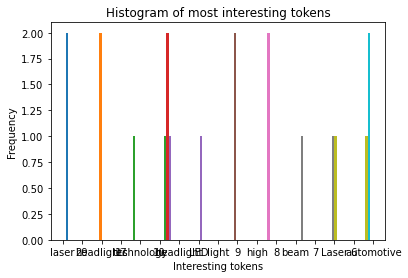
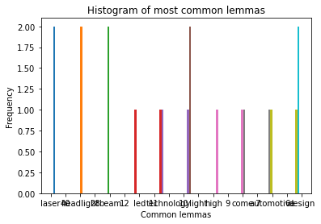

```python
## CSIS 44620 Web Mining and Applied Natural Language Processing
## homework for Module 6
## Presented by Ramon Torres
## DEC 1, 2022
```


```python
## 1 Write code that extracts the article html from https://web.archive.org/web/20210327165005/https://hackaday.com/2021/03/22/how-laser-headlights-work/ and dumps it to a .pkl (or other appropriate file)
import requests
import matplotlib.pyplot as plt
import numpy as np
from matplotlib import colors
from matplotlib.ticker import PercentFormatter


response = requests.get('https://web.archive.org/web/20210327165005/https://hackaday.com/2021/03/22/how-laser-headlights-work/')
print(response.status_code)
print(response.headers['content-type'])

```

    200
    text/html; charset=UTF-8
    


```python
from bs4 import BeautifulSoup

parser = 'html.parser'

soup = BeautifulSoup(response.text, parser)

```


```python
for header in soup.findAll('h1'):
    print('h1 header:', header)
    print('h1 text:', header.text)
```

    h1 header: <h1 class="site-title">
    <a href="https://web.archive.org/web/20210327165005/https://hackaday.com/" rel="home">Hackaday</a>
    </h1>
    h1 text: 
    Hackaday
    
    h1 header: <h1 class="entry-title" itemprop="name">How Laser Headlights Work</h1>
    h1 text: How Laser Headlights Work
    h1 header: <h1 class="screen-reader-text">Post navigation</h1>
    h1 text: Post navigation
    h1 header: <h1 class="widget-title">Search</h1>
    h1 text: Search
    h1 header: <h1 class="widget-title">Never miss a hack</h1>
    h1 text: Never miss a hack
    h1 header: <h1 class="widget-title">Subscribe</h1>
    h1 text: Subscribe
    h1 header: <h1 class="widget-title">If you missed it</h1>
    h1 text: If you missed it
    h1 header: <h1 class="widget-title">Our Columns</h1>
    h1 text: Our Columns
    h1 header: <h1 class="widget-title">Search</h1>
    h1 text: Search
    h1 header: <h1 class="widget-title">Never miss a hack</h1>
    h1 text: Never miss a hack
    h1 header: <h1 class="widget-title">Subscribe</h1>
    h1 text: Subscribe
    h1 header: <h1 class="widget-title">If you missed it</h1>
    h1 text: If you missed it
    h1 header: <h1 class="widget-title">Categories</h1>
    h1 text: Categories
    h1 header: <h1 class="widget-title">Our Columns</h1>
    h1 text: Our Columns
    h1 header: <h1 class="widget-title">Recent comments</h1>
    h1 text: Recent comments
    h1 header: <h1 class="widget-title">Now on Hackaday.io</h1>
    h1 text: Now on Hackaday.io
    h1 header: <h1 class="footer-widget-title">Never miss a hack</h1>
    h1 text: Never miss a hack
    h1 header: <h1 class="footer-widget-title">Subscribe to Newsletter</h1>
    h1 text: Subscribe to Newsletter
    


```python
##2 Read in your article's html source from the file you created in question 1 and print it's text (use .get_text())
article_page = requests.get('https://web.archive.org/web/20210327165005/https://hackaday.com/2021/03/22/how-laser-headlights-work/')
article_html = article_page.text

import pickle
with open('python-match.pkl', 'wb') as f:
    pickle.dump(article_page.text, f)
```


```python
with open('python-match.pkl', 'rb') as f:
    article_html = pickle.load(f)
```


```python
soup = BeautifulSoup(article_html, parser)
```


```python
article_element = soup.find('article').get_text()

```


```python
print(article_element).get_text()
```

    
    
    How Laser Headlights Work
    
    
                    130 Comments            
    
    by:
    Lewin Day
    
    
    
    March 22, 2021
    
    
    
    
    
    
    
    
    When we think about the onward march of automotive technology, headlights aren’t usually the first thing that come to mind. Engines, fuel efficiency, and the switch to electric power are all more front of mind. However, that doesn’t mean there aren’t thousands of engineers around the world working to improve the state of the art in automotive lighting day in, day out.
    Sealed beam headlights gave way to more modern designs once regulations loosened up, while bulbs moved from simple halogens to xenon HIDs and, more recently, LEDs. Now, a new technology is on the scene, with lasers!
    
    Laser Headlights?!
    BWM’s prototype laser headlight assemblies undergoing testing.
    The first image brought to mind by the phrase “laser headlights” is that of laser beams firing out the front of an automobile. Obviously, coherent beams of monochromatic light would make for poor illumination outside of a very specific spot quite some distance away. Thankfully for our eyes, laser headlights don’t work in this way at all.
    Instead, laser headlights consist of one or more solid state laser diodes mounted inside the headlight. These blue lasers are fired at a yellow phosphor, similar to that used in white LEDs. This produces a powerful, vibrant white light that can then be bounced off reflectors and out of the headlights towards the road. Laser headlights built in this way have several benefits. They’re more energy efficient than LEDs that put out the same amount of light, while also being more space efficient, too.
    BWM’s futuristic i8 was one of the first vehicles to ship with laser headlight technology.
    Laser headlights are still a nascent technology, thus far only appearing in a few BMW, Audi, and other select vehicles. BMW’s technology was developed in partnership with lighting experts OSRAM. In practice, a regular LED low-beam lamp is used, with the laser used to create an incredibly bright and focused spot, used for high-beams. This can provide illumination out to 600 meters ahead of the vehicle, double that of conventional LED high beams. The lights use indium gallium nitride diode lasers that were originally used in projectors, with power levels above 1 watt. One of the challenges in implementing such technology in an automotive environment is the need for it to operate at temperature extremes. While research lasers and laser pointers may primarily be used at typical room temperatures, automotive headlights must be able to withstand everything from 40 degrees below zero up to 50 degrees C. Thankfully, the laser’s high efficiency means it doesn’t have huge heat output of its own to further complicate things. Other engineering challenges involve tailoring the optics package for the rough-and-tumble, high vibration environment found in the automotive application. It’s also important to ensure, as with any such device, that the end user can’t be exposed to harmful laser radiation in the event of accident or malfunction.
    Tearing Down the Laser Headlight
    A marketing image showing the construction of an aftermarket LED/laser headlight. We’d take the laser power with a grain of salt — it’s difficult to imagine a 10 W laser shining directly on some small LEDs without melting a hole through the board in short order.
    An aftermarket has sprung up too, with delightfully innovative designs. Combined laser/LED headlights are readily available on Alibaba, designed as a drop in replacement for projector lamps on existing vehicles. These often use an LED low-beam, and a combined LED/laser high beam, where the laser diode shoots directly at the LED phosphor to excite it further, rather than using its own. These units often also come with fan cooling to keep the laser and LEDs below their maximum operational temperature. Such developments are exciting, though it’s important to be wary of the performance of unknown aftermarket headlights. Many aftermarket LED headlight “upgrades” fail to pass muster when it comes to real-world performance, and there’s no reason to believe hybrid LED/laser designs will be any different. We’d love to pass a selection of these parts through a full IIHS test protocol, but that’s sadly beyond the scope (and budget!) of this article.
    However, [mikeselectricstuff] has happened to lay his hands on both the BMW and aftermarket parts, tearing them all down in his workshop to see what makes them tick. The differences are multitude when laid bare on the bench. The AliExpress part is relatively simple, wired up no differently from a regular headlight. Interestingly, however, the laser high-beam circuit runs all the time in these parts. To prevent blinding other road users, a shutter is kept in place to block the light, which is moved out of the way with a solenoid when the driver turns on the high beam switch.
    Where the aftermarket part is a little out of left field, the BMW design is another thing entirely. The cutting-edge headlights are hooked up with multiple connectors and over 30 conductors, with much of the driver electronics living in an external controller. Much of this is to drive the various LEDs and stepper motors for slewing the headlights when steering. However, the laser assembly brings its own complexities. Twin light sensors are built inside to monitor the laser beam, and a special metal blocking arm sits directly in front of the diode, presumably to stop the laser light leaving the headlight in the event the phosphor coating burns through. It’s truly wild to get a look inside a modern luxury car’s headlight and see just how far we’ve come from the old days of simple sealed beams.
    Cost Versus Performance
    Despite the efficiency gains available, the technology remains expensive. Powerful laser diodes don’t come cheap, after all. However, as the technology trickles down to lower-end models, it’s likely that we could see economies of scale change that for the better. Indeed, if national authorities begin to demand higher performance headlights as standard, we could see laser headlights become the norm, rather than an expensive luxury. The technology could naturally be applied to home and commercial lighting, too — though we suspect the potential gains are limited enough that LED lighting will remain the norm for some time to come.
    The high light output of laser headlights in a compact package allows engineers greater freedom when designing the front-end of a car.
    As it currently stands, much of the appeal of the new technology is about the packaging benefits, which allow automotive designers greater freedom around the headlight area. Such concerns are less of a factor when it comes to light fittings in the home or office, or indeed, on lower-end automobiles. Regardless, it’s an exciting new application for lasers and one we’ll be sure to see more of in the future.
     
    
    
    
    
     
    
    
    
    
    
    
    
    
    
    
    
    
    
    
    
    
    
    
    
    Posted in car hacks, Engineering, Featured, Laser Hacks, SliderTagged laser, laser headlight, laser headlights, light 
    
    


    ---------------------------------------------------------------------------

    AttributeError                            Traceback (most recent call last)

    Input In [48], in <cell line: 1>()
    ----> 1 print(article_element).get_text()
    

    AttributeError: 'NoneType' object has no attribute 'get_text'


```python
## 3. Load the article text into a trained spaCy pipeline, and determine the 5 most frequent tokens (converted to lower case). Print the common tokens with an appropriate label. Additionally, print the tokens their frequencies (with appropriate labels). Make sure to remove things we don't care about (punctuation, stopwords, whitespace).
import spacy
from spacytextblob.spacytextblob import SpacyTextBlob
## 4. Load the article text into a trained spaCy pipeline, and determine the 5 most frequent lemmas (converted to lower case). Print the common lemmas with an appropriate label. Additionally, print the lemmas with their frequencies (with appropriate labels). Make sure to remove things we don't care about (punctuation, stopwords, whitespace).

nlp = spacy.load('en_core_web_sm')
nlp.add_pipe('spacytextblob')
doc = nlp(article_element)

## Check for polarity for BONUS Points
print(f'Polarity: {doc._.polarity}')
```

    Polarity: 0.1325758769416858
    


```python
## 5. Define the following methods:

score_sentence_by_token(sentence, interesting_token) that takes a sentence and a list of interesting token and returns the number of times that any of the interesting words appear in the sentence divided by the number of words in the sentence
score_sentence_by_lemma(sentence, interesting_lemmas) that takes a sentence and a list of interesting lemmas and returns the number of times that any of the interesting lemmas appear in the sentence divided by the number of words in the sentence

for lexeme in doc[:10]: # just the first 10 for now
    print('---',lexeme)
```

    --- 
    
    
    --- How
    --- Laser
    --- Headlights
    --- Work
    --- 
    
    
                    
    --- 130
    --- Comments
    ---            
    
    
    --- by
    


```python
non_ws_tokens = []
for token in doc:
    if not token.is_space:
        non_ws_tokens.append(token)
print(non_ws_tokens)
```

    [How, Laser, Headlights, Work, 130, Comments, by, :, Lewin, Day, March, 22, ,, 2021, When, we, think, about, the, onward, march, of, automotive, technology, ,, headlights, are, n’t, usually, the, first, thing, that, come, to, mind, ., Engines, ,, fuel, efficiency, ,, and, the, switch, to, electric, power, are, all, more, front, of, mind, ., However, ,, that, does, n’t, mean, there, are, n’t, thousands, of, engineers, around, the, world, working, to, improve, the, state, of, the, art, in, automotive, lighting, day, in, ,, day, out, ., Sealed, beam, headlights, gave, way, to, more, modern, designs, once, regulations, loosened, up, ,, while, bulbs, moved, from, simple, halogens, to, xenon, HIDs, and, ,, more, recently, ,, LEDs, ., Now, ,, a, new, technology, is, on, the, scene, ,, with, lasers, !, Laser, Headlights, ?, !, BWM, ’s, prototype, laser, headlight, assemblies, undergoing, testing, ., The, first, image, brought, to, mind, by, the, phrase, “, laser, headlights, ”, is, that, of, laser, beams, firing, out, the, front, of, an, automobile, ., Obviously, ,, coherent, beams, of, monochromatic, light, would, make, for, poor, illumination, outside, of, a, very, specific, spot, quite, some, distance, away, ., Thankfully, for, our, eyes, ,, laser, headlights, do, n’t, work, in, this, way, at, all, ., Instead, ,, laser, headlights, consist, of, one, or, more, solid, state, laser, diodes, mounted, inside, the, headlight, ., These, blue, lasers, are, fired, at, a, yellow, phosphor, ,, similar, to, that, used, in, white, LEDs, ., This, produces, a, powerful, ,, vibrant, white, light, that, can, then, be, bounced, off, reflectors, and, out, of, the, headlights, towards, the, road, ., Laser, headlights, built, in, this, way, have, several, benefits, ., They, ’re, more, energy, efficient, than, LEDs, that, put, out, the, same, amount, of, light, ,, while, also, being, more, space, efficient, ,, too, ., BWM, ’s, futuristic, i8, was, one, of, the, first, vehicles, to, ship, with, laser, headlight, technology, ., Laser, headlights, are, still, a, nascent, technology, ,, thus, far, only, appearing, in, a, few, BMW, ,, Audi, ,, and, other, select, vehicles, ., BMW, ’s, technology, was, developed, in, partnership, with, lighting, experts, OSRAM, ., In, practice, ,, a, regular, LED, low, -, beam, lamp, is, used, ,, with, the, laser, used, to, create, an, incredibly, bright, and, focused, spot, ,, used, for, high, -, beams, ., This, can, provide, illumination, out, to, 600, meters, ahead, of, the, vehicle, ,, double, that, of, conventional, LED, high, beams, ., The, lights, use, indium, gallium, nitride, diode, lasers, that, were, originally, used, in, projectors, ,, with, power, levels, above, 1, watt, ., One, of, the, challenges, in, implementing, such, technology, in, an, automotive, environment, is, the, need, for, it, to, operate, at, temperature, extremes, ., While, research, lasers, and, laser, pointers, may, primarily, be, used, at, typical, room, temperatures, ,, automotive, headlights, must, be, able, to, withstand, everything, from, 40, degrees, below, zero, up, to, 50, degrees, C., Thankfully, ,, the, laser, ’s, high, efficiency, means, it, does, n’t, have, huge, heat, output, of, its, own, to, further, complicate, things, ., Other, engineering, challenges, involve, tailoring, the, optics, package, for, the, rough, -, and, -, tumble, ,, high, vibration, environment, found, in, the, automotive, application, ., It, ’s, also, important, to, ensure, ,, as, with, any, such, device, ,, that, the, end, user, ca, n’t, be, exposed, to, harmful, laser, radiation, in, the, event, of, accident, or, malfunction, ., Tearing, Down, the, Laser, Headlight, A, marketing, image, showing, the, construction, of, an, aftermarket, LED, /, laser, headlight, ., We, ’d, take, the, laser, power, with, a, grain, of, salt, —, it, ’s, difficult, to, imagine, a, 10, W, laser, shining, directly, on, some, small, LEDs, without, melting, a, hole, through, the, board, in, short, order, ., An, aftermarket, has, sprung, up, too, ,, with, delightfully, innovative, designs, ., Combined, laser, /, LED, headlights, are, readily, available, on, Alibaba, ,, designed, as, a, drop, in, replacement, for, projector, lamps, on, existing, vehicles, ., These, often, use, an, LED, low, -, beam, ,, and, a, combined, LED, /, laser, high, beam, ,, where, the, laser, diode, shoots, directly, at, the, LED, phosphor, to, excite, it, further, ,, rather, than, using, its, own, ., These, units, often, also, come, with, fan, cooling, to, keep, the, laser, and, LEDs, below, their, maximum, operational, temperature, ., Such, developments, are, exciting, ,, though, it, ’s, important, to, be, wary, of, the, performance, of, unknown, aftermarket, headlights, ., Many, aftermarket, LED, headlight, “, upgrades, ”, fail, to, pass, muster, when, it, comes, to, real, -, world, performance, ,, and, there, ’s, no, reason, to, believe, hybrid, LED, /, laser, designs, will, be, any, different, ., We, ’d, love, to, pass, a, selection, of, these, parts, through, a, full, IIHS, test, protocol, ,, but, that, ’s, sadly, beyond, the, scope, (, and, budget, !, ), of, this, article, ., However, ,, [, mikeselectricstuff, ], has, happened, to, lay, his, hands, on, both, the, BMW, and, aftermarket, parts, ,, tearing, them, all, down, in, his, workshop, to, see, what, makes, them, tick, ., The, differences, are, multitude, when, laid, bare, on, the, bench, ., The, AliExpress, part, is, relatively, simple, ,, wired, up, no, differently, from, a, regular, headlight, ., Interestingly, ,, however, ,, the, laser, high, -, beam, circuit, runs, all, the, time, in, these, parts, ., To, prevent, blinding, other, road, users, ,, a, shutter, is, kept, in, place, to, block, the, light, ,, which, is, moved, out, of, the, way, with, a, solenoid, when, the, driver, turns, on, the, high, beam, switch, ., Where, the, aftermarket, part, is, a, little, out, of, left, field, ,, the, BMW, design, is, another, thing, entirely, ., The, cutting, -, edge, headlights, are, hooked, up, with, multiple, connectors, and, over, 30, conductors, ,, with, much, of, the, driver, electronics, living, in, an, external, controller, ., Much, of, this, is, to, drive, the, various, LEDs, and, stepper, motors, for, slewing, the, headlights, when, steering, ., However, ,, the, laser, assembly, brings, its, own, complexities, ., Twin, light, sensors, are, built, inside, to, monitor, the, laser, beam, ,, and, a, special, metal, blocking, arm, sits, directly, in, front, of, the, diode, ,, presumably, to, stop, the, laser, light, leaving, the, headlight, in, the, event, the, phosphor, coating, burns, through, ., It, ’s, truly, wild, to, get, a, look, inside, a, modern, luxury, car, ’s, headlight, and, see, just, how, far, we, ’ve, come, from, the, old, days, of, simple, sealed, beams, ., Cost, Versus, Performance, Despite, the, efficiency, gains, available, ,, the, technology, remains, expensive, ., Powerful, laser, diodes, do, n’t, come, cheap, ,, after, all, ., However, ,, as, the, technology, trickles, down, to, lower, -, end, models, ,, it, ’s, likely, that, we, could, see, economies, of, scale, change, that, for, the, better, ., Indeed, ,, if, national, authorities, begin, to, demand, higher, performance, headlights, as, standard, ,, we, could, see, laser, headlights, become, the, norm, ,, rather, than, an, expensive, luxury, ., The, technology, could, naturally, be, applied, to, home, and, commercial, lighting, ,, too, —, though, we, suspect, the, potential, gains, are, limited, enough, that, LED, lighting, will, remain, the, norm, for, some, time, to, come, ., The, high, light, output, of, laser, headlights, in, a, compact, package, allows, engineers, greater, freedom, when, designing, the, front, -, end, of, a, car, ., As, it, currently, stands, ,, much, of, the, appeal, of, the, new, technology, is, about, the, packaging, benefits, ,, which, allow, automotive, designers, greater, freedom, around, the, headlight, area, ., Such, concerns, are, less, of, a, factor, when, it, comes, to, light, fittings, in, the, home, or, office, ,, or, indeed, ,, on, lower, -, end, automobiles, ., Regardless, ,, it, ’s, an, exciting, new, application, for, lasers, and, one, we, ’ll, be, sure, to, see, more, of, in, the, future, ., Posted, in, car, hacks, ,, Engineering, ,, Featured, ,, Laser, Hacks, ,, SliderTagged, laser, ,, laser, headlight, ,, laser, headlights, ,, light]
    


```python
def we_care_about(token):
    return not (token.is_space or token.is_punct)

interesting_tokens = [token for token in doc if we_care_about(token)]
print(interesting_tokens)
```

    [How, Laser, Headlights, Work, 130, Comments, by, Lewin, Day, March, 22, 2021, When, we, think, about, the, onward, march, of, automotive, technology, headlights, are, n’t, usually, the, first, thing, that, come, to, mind, Engines, fuel, efficiency, and, the, switch, to, electric, power, are, all, more, front, of, mind, However, that, does, n’t, mean, there, are, n’t, thousands, of, engineers, around, the, world, working, to, improve, the, state, of, the, art, in, automotive, lighting, day, in, day, out, Sealed, beam, headlights, gave, way, to, more, modern, designs, once, regulations, loosened, up, while, bulbs, moved, from, simple, halogens, to, xenon, HIDs, and, more, recently, LEDs, Now, a, new, technology, is, on, the, scene, with, lasers, Laser, Headlights, BWM, ’s, prototype, laser, headlight, assemblies, undergoing, testing, The, first, image, brought, to, mind, by, the, phrase, laser, headlights, is, that, of, laser, beams, firing, out, the, front, of, an, automobile, Obviously, coherent, beams, of, monochromatic, light, would, make, for, poor, illumination, outside, of, a, very, specific, spot, quite, some, distance, away, Thankfully, for, our, eyes, laser, headlights, do, n’t, work, in, this, way, at, all, Instead, laser, headlights, consist, of, one, or, more, solid, state, laser, diodes, mounted, inside, the, headlight, These, blue, lasers, are, fired, at, a, yellow, phosphor, similar, to, that, used, in, white, LEDs, This, produces, a, powerful, vibrant, white, light, that, can, then, be, bounced, off, reflectors, and, out, of, the, headlights, towards, the, road, Laser, headlights, built, in, this, way, have, several, benefits, They, ’re, more, energy, efficient, than, LEDs, that, put, out, the, same, amount, of, light, while, also, being, more, space, efficient, too, BWM, ’s, futuristic, i8, was, one, of, the, first, vehicles, to, ship, with, laser, headlight, technology, Laser, headlights, are, still, a, nascent, technology, thus, far, only, appearing, in, a, few, BMW, Audi, and, other, select, vehicles, BMW, ’s, technology, was, developed, in, partnership, with, lighting, experts, OSRAM, In, practice, a, regular, LED, low, beam, lamp, is, used, with, the, laser, used, to, create, an, incredibly, bright, and, focused, spot, used, for, high, beams, This, can, provide, illumination, out, to, 600, meters, ahead, of, the, vehicle, double, that, of, conventional, LED, high, beams, The, lights, use, indium, gallium, nitride, diode, lasers, that, were, originally, used, in, projectors, with, power, levels, above, 1, watt, One, of, the, challenges, in, implementing, such, technology, in, an, automotive, environment, is, the, need, for, it, to, operate, at, temperature, extremes, While, research, lasers, and, laser, pointers, may, primarily, be, used, at, typical, room, temperatures, automotive, headlights, must, be, able, to, withstand, everything, from, 40, degrees, below, zero, up, to, 50, degrees, C., Thankfully, the, laser, ’s, high, efficiency, means, it, does, n’t, have, huge, heat, output, of, its, own, to, further, complicate, things, Other, engineering, challenges, involve, tailoring, the, optics, package, for, the, rough, and, tumble, high, vibration, environment, found, in, the, automotive, application, It, ’s, also, important, to, ensure, as, with, any, such, device, that, the, end, user, ca, n’t, be, exposed, to, harmful, laser, radiation, in, the, event, of, accident, or, malfunction, Tearing, Down, the, Laser, Headlight, A, marketing, image, showing, the, construction, of, an, aftermarket, LED, laser, headlight, We, ’d, take, the, laser, power, with, a, grain, of, salt, it, ’s, difficult, to, imagine, a, 10, W, laser, shining, directly, on, some, small, LEDs, without, melting, a, hole, through, the, board, in, short, order, An, aftermarket, has, sprung, up, too, with, delightfully, innovative, designs, Combined, laser, LED, headlights, are, readily, available, on, Alibaba, designed, as, a, drop, in, replacement, for, projector, lamps, on, existing, vehicles, These, often, use, an, LED, low, beam, and, a, combined, LED, laser, high, beam, where, the, laser, diode, shoots, directly, at, the, LED, phosphor, to, excite, it, further, rather, than, using, its, own, These, units, often, also, come, with, fan, cooling, to, keep, the, laser, and, LEDs, below, their, maximum, operational, temperature, Such, developments, are, exciting, though, it, ’s, important, to, be, wary, of, the, performance, of, unknown, aftermarket, headlights, Many, aftermarket, LED, headlight, upgrades, fail, to, pass, muster, when, it, comes, to, real, world, performance, and, there, ’s, no, reason, to, believe, hybrid, LED, laser, designs, will, be, any, different, We, ’d, love, to, pass, a, selection, of, these, parts, through, a, full, IIHS, test, protocol, but, that, ’s, sadly, beyond, the, scope, and, budget, of, this, article, However, mikeselectricstuff, has, happened, to, lay, his, hands, on, both, the, BMW, and, aftermarket, parts, tearing, them, all, down, in, his, workshop, to, see, what, makes, them, tick, The, differences, are, multitude, when, laid, bare, on, the, bench, The, AliExpress, part, is, relatively, simple, wired, up, no, differently, from, a, regular, headlight, Interestingly, however, the, laser, high, beam, circuit, runs, all, the, time, in, these, parts, To, prevent, blinding, other, road, users, a, shutter, is, kept, in, place, to, block, the, light, which, is, moved, out, of, the, way, with, a, solenoid, when, the, driver, turns, on, the, high, beam, switch, Where, the, aftermarket, part, is, a, little, out, of, left, field, the, BMW, design, is, another, thing, entirely, The, cutting, edge, headlights, are, hooked, up, with, multiple, connectors, and, over, 30, conductors, with, much, of, the, driver, electronics, living, in, an, external, controller, Much, of, this, is, to, drive, the, various, LEDs, and, stepper, motors, for, slewing, the, headlights, when, steering, However, the, laser, assembly, brings, its, own, complexities, Twin, light, sensors, are, built, inside, to, monitor, the, laser, beam, and, a, special, metal, blocking, arm, sits, directly, in, front, of, the, diode, presumably, to, stop, the, laser, light, leaving, the, headlight, in, the, event, the, phosphor, coating, burns, through, It, ’s, truly, wild, to, get, a, look, inside, a, modern, luxury, car, ’s, headlight, and, see, just, how, far, we, ’ve, come, from, the, old, days, of, simple, sealed, beams, Cost, Versus, Performance, Despite, the, efficiency, gains, available, the, technology, remains, expensive, Powerful, laser, diodes, do, n’t, come, cheap, after, all, However, as, the, technology, trickles, down, to, lower, end, models, it, ’s, likely, that, we, could, see, economies, of, scale, change, that, for, the, better, Indeed, if, national, authorities, begin, to, demand, higher, performance, headlights, as, standard, we, could, see, laser, headlights, become, the, norm, rather, than, an, expensive, luxury, The, technology, could, naturally, be, applied, to, home, and, commercial, lighting, too, though, we, suspect, the, potential, gains, are, limited, enough, that, LED, lighting, will, remain, the, norm, for, some, time, to, come, The, high, light, output, of, laser, headlights, in, a, compact, package, allows, engineers, greater, freedom, when, designing, the, front, end, of, a, car, As, it, currently, stands, much, of, the, appeal, of, the, new, technology, is, about, the, packaging, benefits, which, allow, automotive, designers, greater, freedom, around, the, headlight, area, Such, concerns, are, less, of, a, factor, when, it, comes, to, light, fittings, in, the, home, or, office, or, indeed, on, lower, end, automobiles, Regardless, it, ’s, an, exciting, new, application, for, lasers, and, one, we, ’ll, be, sure, to, see, more, of, in, the, future, Posted, in, car, hacks, Engineering, Featured, Laser, Hacks, SliderTagged, laser, laser, headlight, laser, headlights, light]
    


```python
from collections import Counter
word_freq = Counter(map(str,interesting_tokens))
print(word_freq.most_common(10))
```

    [('the', 68), ('to', 37), ('of', 36), ('laser', 29), ('in', 24), ('a', 24), ('and', 18), ('headlights', 17), ('that', 13), ('’s', 13)]
    


```python
import matplotlib.pyplot as plt
import numpy as np
from matplotlib import colors
from matplotlib.ticker import PercentFormatter
```


```python
def we_care_about(token):
    return not (token.is_space or token.is_punct or token.is_stop)

interesting_tokens = [token for token in doc if we_care_about(token)]
word_freq = Counter(map(str,interesting_tokens))
print(word_freq.most_common(10))
```

    [('laser', 29), ('headlights', 17), ('technology', 10), ('headlight', 10), ('LED', 10), ('light', 9), ('high', 8), ('beam', 7), ('Laser', 6), ('automotive', 6)]
    


```python
interesting_lemmas = [token.lemma_ for token in doc if we_care_about(token)]
lemma_freq = Counter(interesting_lemmas)
print(lemma_freq.most_common(10))
```

    [('laser', 34), ('headlight', 27), ('beam', 12), ('led', 11), ('technology', 10), ('light', 10), ('high', 9), ('come', 7), ('Laser', 6), ('automotive', 6)]
    


```python
## 6. Make a list containing the scores (using tokens) of every sentence in the article, and plot a histogram with appropriate titles and axis labels of the scores. From your histogram, what seems to be the most common range of scores (put the answer in a comment after your code)?
plt.xlabel('Interesting tokens')
plt.ylabel('Frequency')
plt.title('Histogram of most interesting tokens')
plt.hist(word_freq.most_common(10))
```


    (array([[2., 0., 0., 0., 0., 0., 0., 0., 0., 0.],
            [0., 2., 0., 0., 0., 0., 0., 0., 0., 0.],
            [0., 0., 1., 1., 0., 0., 0., 0., 0., 0.],
            [0., 0., 0., 2., 0., 0., 0., 0., 0., 0.],
            [0., 0., 0., 1., 1., 0., 0., 0., 0., 0.],
            [0., 0., 0., 0., 0., 2., 0., 0., 0., 0.],
            [0., 0., 0., 0., 0., 0., 2., 0., 0., 0.],
            [0., 0., 0., 0., 0., 0., 0., 1., 1., 0.],
            [0., 0., 0., 0., 0., 0., 0., 0., 1., 1.],
            [0., 0., 0., 0., 0., 0., 0., 0., 0., 2.]]),
     array([ 0. ,  1.6,  3.2,  4.8,  6.4,  8. ,  9.6, 11.2, 12.8, 14.4, 16. ]),
     <a list of 10 BarContainer objects>)


    

    


```python
## 7. Make a list containing the scores (using lemmas) of every sentence in the article, and plot a histogram with appropriate titles and axis labels of the scores. From your histogram, what seems to be the most common range of scores (put the answer in a comment after your code)?
plt.xlabel('Common lemmas')
plt.ylabel('Frequency')
plt.title('Histogram of most common lemmas')
plt.hist(lemma_freq.most_common(10))
```


    (array([[2., 0., 0., 0., 0., 0., 0., 0., 0., 0.],
            [0., 2., 0., 0., 0., 0., 0., 0., 0., 0.],
            [0., 0., 2., 0., 0., 0., 0., 0., 0., 0.],
            [0., 0., 0., 1., 1., 0., 0., 0., 0., 0.],
            [0., 0., 0., 0., 1., 1., 0., 0., 0., 0.],
            [0., 0., 0., 0., 0., 2., 0., 0., 0., 0.],
            [0., 0., 0., 0., 0., 0., 1., 1., 0., 0.],
            [0., 0., 0., 0., 0., 0., 0., 1., 1., 0.],
            [0., 0., 0., 0., 0., 0., 0., 0., 1., 1.],
            [0., 0., 0., 0., 0., 0., 0., 0., 0., 2.]]),
     array([ 0. ,  1.7,  3.4,  5.1,  6.8,  8.5, 10.2, 11.9, 13.6, 15.3, 17. ]),
     <a list of 10 BarContainer objects>)


    

    


```python
interesting_lemmas = [token.lemma_.lower() for token in doc if we_care_about(token)]
lemma_freq = Counter(interesting_lemmas)
print(lemma_freq.most_common(10))
```

    [('laser', 40), ('headlight', 28), ('beam', 12), ('led', 11), ('technology', 10), ('light', 10), ('high', 9), ('come', 7), ('automotive', 6), ('design', 6)]
    


```python
## 7. Make a list containing the scores (using lemmas) of every sentence in the article, and plot a histogram with appropriate titles and axis labels of the scores. From your histogram, what seems to be the most common range of scores (put the answer in a comment after your code)?
plt.xlabel('Common lemmas')
plt.ylabel('Frequency')
plt.title('Histogram of most common lemmas')
plt.hist(lemma_freq.most_common(10))
```


    (array([[2., 0., 0., 0., 0., 0., 0., 0., 0., 0.],
            [0., 2., 0., 0., 0., 0., 0., 0., 0., 0.],
            [0., 0., 2., 0., 0., 0., 0., 0., 0., 0.],
            [0., 0., 0., 1., 1., 0., 0., 0., 0., 0.],
            [0., 0., 0., 0., 1., 1., 0., 0., 0., 0.],
            [0., 0., 0., 0., 0., 2., 0., 0., 0., 0.],
            [0., 0., 0., 0., 0., 0., 1., 1., 0., 0.],
            [0., 0., 0., 0., 0., 0., 0., 1., 1., 0.],
            [0., 0., 0., 0., 0., 0., 0., 0., 1., 1.],
            [0., 0., 0., 0., 0., 0., 0., 0., 0., 2.]]),
     array([ 0. ,  1.7,  3.4,  5.1,  6.8,  8.5, 10.2, 11.9, 13.6, 15.3, 17. ]),
     <a list of 10 BarContainer objects>)


    

    


```python
cool_words = set()
for lemma, freq in lemma_freq.most_common(5):
    cool_words.add(lemma)
print(cool_words)
```

    {'technology', 'laser', 'beam', 'led', 'headlight'}
    


```python
sentences = list(doc.sents) 
for sentence in sentences:
    count = 0
    for token in sentence:
        if token.lemma_.lower() in cool_words:
            count += 1
    sent_str = str(sentence).replace('\n','').replace('  ',' ')
    print(count,':', sent_str)
```

    1 : How Laser Headlights Work        130 Comments      by:Lewin DayMarch 22, 2021
    2 : When we think about the onward march of automotive technology, headlights aren’t usually the first thing that come to mind.
    0 : Engines, fuel efficiency, and the switch to electric power are all more front of mind.
    0 : However, that doesn’t mean there aren’t thousands of engineers around the world working to improve the state of the art in automotive lighting day in, day out.
    3 : Sealed beam headlights gave way to more modern designs once regulations loosened up, while bulbs moved from simple halogens to xenon HIDs and, more recently, LEDs.
    2 : Now, a new technology is on the scene, with lasers!
    1 : Laser Headlights?!
    2 : BWM’s prototype laser headlight assemblies undergoing testing.
    4 : The first image brought to mind by the phrase “laser headlights” is that of laser beams firing out the front of an automobile.
    1 : Obviously, coherent beams of monochromatic light would make for poor illumination outside of a very specific spot quite some distance away.
    2 : Thankfully for our eyes, laser headlights don’t work in this way at all.
    4 : Instead, laser headlights consist of one or more solid state laser diodes mounted inside the headlight.
    2 : These blue lasers are fired at a yellow phosphor, similar to that used in white LEDs.
    1 : This produces a powerful, vibrant white light that can then be bounced off reflectors and out of the headlights towards the road.
    2 : Laser headlights built in this way have several benefits.
    1 : They’re more energy efficient than LEDs that put out the same amount of light, while also being more space efficient, too.
    3 : BWM’s futuristic i8 was one of the first vehicles to ship with laser headlight technology.
    3 : Laser headlights are still a nascent technology, thus far only appearing in a few BMW, Audi, and other select vehicles.
    1 : BMW’s technology was developed in partnership with lighting experts OSRAM.
    3 : In practice, a regular LED low-beam lamp is used, with the laser used to create an incredibly bright and focused spot, used for high-beams.
    1 : This can provide illumination out to 600 meters ahead of the vehicle, double that of conventional LED high beams.
    1 : The lights use indium gallium nitride diode lasers that were originally used in projectors, with power levels above 1 watt.
    1 : One of the challenges in implementing such technology in an automotive environment is the need for it to operate at temperature extremes.
    3 : While research lasers and laser pointers may primarily be used at typical room temperatures, automotive headlights must be able to withstand everything from 40 degrees below zero
    1 : up to 50 degrees C. Thankfully, the laser’s high efficiency means it doesn’t have huge heat output of its own to further complicate things.
    0 : Other engineering challenges involve tailoring the optics package for the rough-and-tumble, high vibration environment found in the automotive application.
    1 : It’s also important to ensure, as with any such device, that the end user can’t be exposed to harmful laser radiation in the event of accident or malfunction.
    5 : Tearing Down the Laser HeadlightA marketing image showing the construction of an aftermarket LED/laser headlight.
    3 : We’d take the laser power with a grain of salt — it’s difficult to imagine a 10 W laser shining directly on some small LEDs without melting a hole through the board in short order.
    0 : An aftermarket has sprung up too, with delightfully innovative designs.
    3 : Combined laser/LED headlights are readily available on Alibaba, designed as a drop in replacement for projector lamps on existing vehicles.
    5 : These often use an LED low-beam, and a combined LED/laser high beam, where the laser diode shoots directly at the LED phosphor to excite it further, rather than using its own.
    2 : These units often also come with fan cooling to keep the laser and LEDs below their maximum operational temperature.
    1 : Such developments are exciting, though it’s important to be wary of the performance of unknown aftermarket headlights.
    3 : Many aftermarket LED headlight “upgrades” fail to pass muster when it comes to real-world performance, and there’s no reason to believe hybrid LED/laser designs will be any different.
    0 : We’d love to pass a selection of these parts through a full IIHS test protocol, but that’s sadly beyond the scope (and budget!) of this article.
    0 : However, [mikeselectricstuff] has happened to lay his hands on both the BMW and aftermarket parts, tearing them all down in his workshop to see what makes them tick.
    0 : The differences are multitude when laid bare on the bench.
    1 : The AliExpress part is relatively simple, wired up no differently from a regular headlight.
    2 : Interestingly, however, the laser high-beam circuit runs all the time in these parts.
    1 : To prevent blinding other road users, a shutter is kept in place to block the light, which is moved out of the way with a solenoid when the driver turns on the high beam switch.
    0 : Where the aftermarket part is a little out of left field, the BMW design is another thing entirely.
    1 : The cutting-edge headlights are hooked up with multiple connectors and over 30 conductors, with much of the driver electronics living in an external controller.
    2 : Much of this is to drive the various LEDs and stepper motors for slewing the headlights when steering.
    1 : However, the laser assembly brings its own complexities.
    4 : Twin light sensors are built inside to monitor the laser beam, and a special metal blocking arm sits directly in front of the diode, presumably to stop the laser light leaving the headlight in the event the phosphor coating burns through.
    2 : It’s truly wild to get a look inside a modern luxury car’s headlight and see just how far we’ve come from the old days of simple sealed beams.
    1 : Cost Versus PerformanceDespite the efficiency gains available, the technology remains expensive.
    1 : Powerful laser diodes don’t come cheap, after all.
    1 : However, as the technology trickles down to lower-end models, it’s likely that we could see economies of scale change that for the better.
    3 : Indeed, if national authorities begin to demand higher performance headlights as standard, we could see laser headlights become the norm, rather than an expensive luxury.
    2 : The technology could naturally be applied to home and commercial lighting, too — though we suspect the potential gains are limited enough that LED lighting will remain the norm for some time to come.
    2 : The high light output of laser headlights in a compact package allows engineers greater freedom when designing the front-end of a car.
    2 : As it currently stands, much of the appeal of the new technology is about the packaging benefits, which allow automotive designers greater freedom around the headlight area.
    0 : Such concerns are less of a factor when it comes to light fittings in the home or office, or indeed, on lower-end automobiles.
    1 : Regardless, it’s an exciting new application for lasers and one we’ll be sure to see more of in the future.  
    6 : Posted in car hacks, Engineering, Featured, Laser Hacks, SliderTagged laser, laser headlight, laser headlights, light 
    


```python
def sentence_length (sent):
    count = 0
    for token in sent:
        if not(token.is_space or token.is_punct):
            count += 1
    return count
print(sentence_length(sentences[0]), sentences[0])
```

    12 
    
    How Laser Headlights Work
    
    
                    130 Comments            
    
    by:
    Lewin Day
    
    
    
    March 22, 2021
    
    
    
    
    
    
    
    
    
    


```python
## 8 Which tokens and lexems would be ommitted from the lists generated in questions 3 and 4 if we only wanted to consider nouns as interesting words? How might we change the code to only consider nouns? Put your answer in this Markdown cell (you can edit it by double clicking it).
```


```python
## Will need to tokenize using  nlkt, while searching some additional sources, 
## Pythons NLTK or ToolKit has a number of functions that allow us to extract various information from a text. found nltk to segragate nouns in a sentence for example:
## Sample code
import nltk
lines = 'Natural processinng language applications are useful'
# function to test if something is a noun
is_noun = lambda pos: pos[:2] == 'NN'
# do the nlp stuff
tokenized = nltk.word_tokenize(lines)
nouns = [word for (word, pos) in nltk.pos_tag(tokenized) if is_noun(pos)] 

print(nouns)

```

    ['Natural', 'processinng', 'language', 'applications']
    


```python

```
